# Geryon Architecture

**Geryon** is a high-performance, multi-database connection pooler and proxy built in **pure Go** with **minimal dependencies**. Named after the three-bodied giant of Greek mythology, Geryon speaks PostgreSQL, MySQL, and MSSQL wire protocols from a single static binary.

## Table of Contents

- [Three Bodies Architecture](#three-bodies-architecture)
- [High-Level Overview](#high-level-overview)
- [Core Components](#core-components)
- [Connection Pooling](#connection-pooling)
- [Clustering](#clustering)
- [Security](#security)
- [Configuration](#configuration)
- [Data Flow Diagrams](#data-flow-diagrams)

---

## Three Bodies Architecture

Geryon implements three database protocol handlers ("Bodies"):

| Body | Protocol | Default Port | Wire Protocol |
|------|----------|--------------|----------------|
| **PostgreSQL** | PostgreSQL | 5432 | Frontend/Backend v3.0 |
| **MySQL** | MySQL | 3306 | Handshake v10 |
| **MSSQL** | TDS | 1433 | TDS 7.4+ |

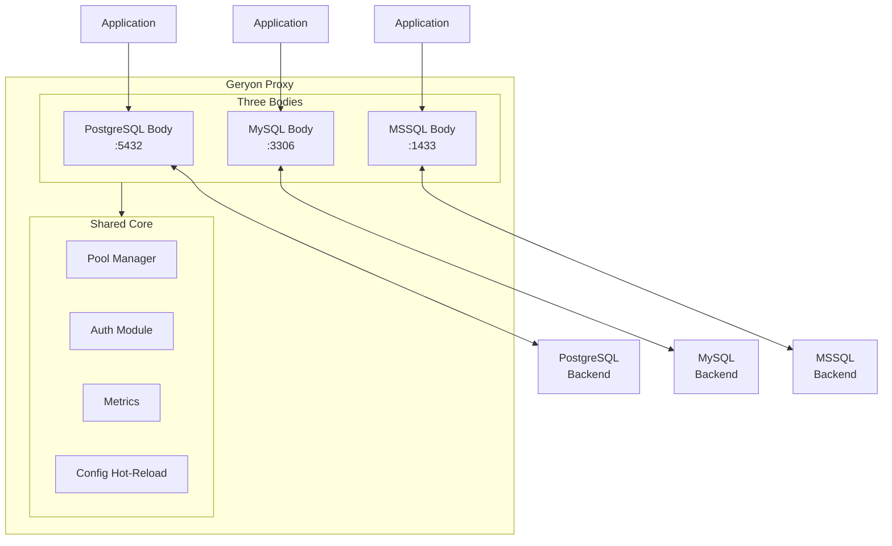

---

## High-Level Overview

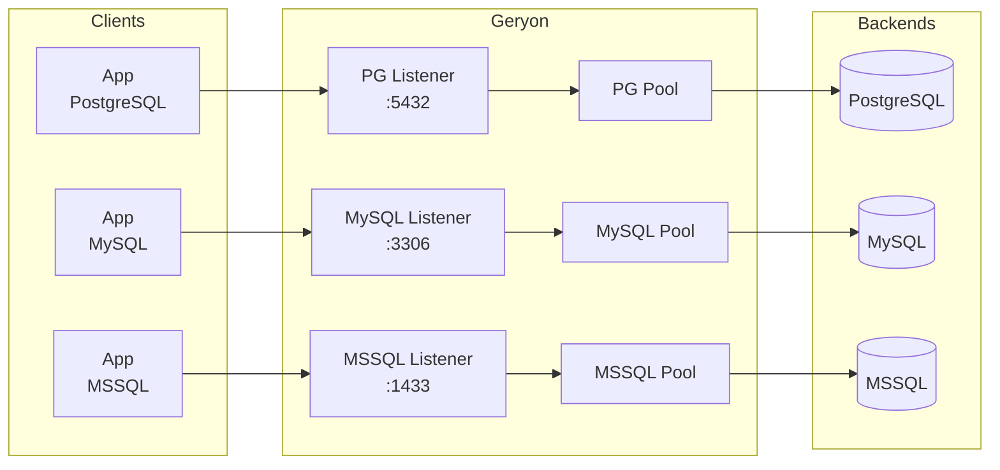

### Key Design Principles

1. **Pure Go** — No C dependencies, CGO_ENABLED=0 for releases
2. **Single Binary** — Embedded assets via `embed.FS`
3. **Minimal Dependencies** — Only essential external packages
4. **Lock-Free Reads** — Atomic configuration access during hot-reload
5. **Multi-Protocol** — Native wire protocol handling for three databases

---

## Core Components

### Component Hierarchy

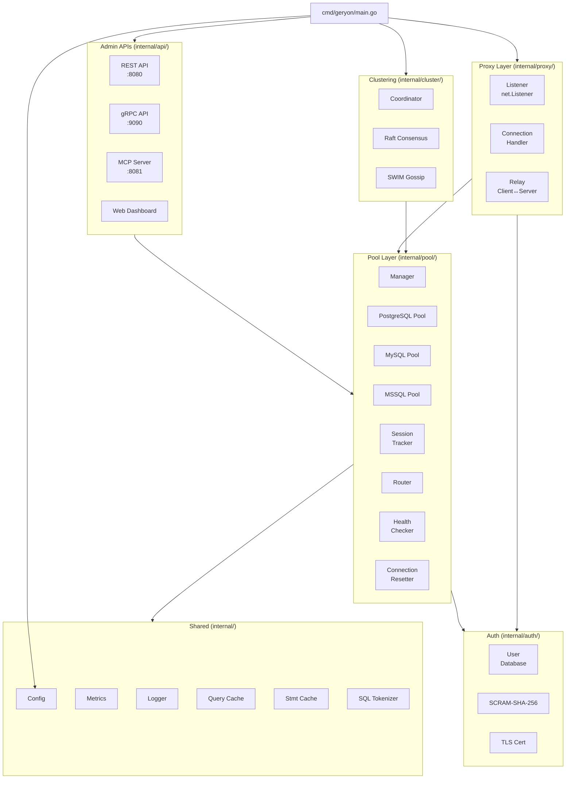

### Package Responsibilities

| Package | Responsibility |
|---------|----------------|
| `cmd/geryon/` | Entry point, signal handling, hot-reload orchestration |
| `internal/proxy/` | TCP listeners, protocol-specific connection handling, auth relay |
| `internal/pool/` | Connection pooling, session tracking, routing, health checks |
| `internal/auth/` | User credentials, SCRAM-SHA-256, TLS certificates |
| `internal/config/` | YAML loading, validation, file watching, hot-reload |
| `internal/cluster/` | Raft + SWIM integration, leader election |
| `internal/raft/` | Raft consensus algorithm (custom implementation) |
| `internal/swim/` | SWIM gossip protocol (custom implementation) |
| `internal/api/rest/` | REST admin API on :8080 |
| `internal/api/grpc/` | gRPC admin API on :9090 |
| `internal/api/mcp/` | MCP server on :8081 |
| `internal/metrics/` | Prometheus-compatible metrics |
| `internal/cache/` | LRU query result cache with TTL |
| `internal/stmt/` | Prepared statement cache |
| `internal/tokenizer/` | SQL query classification |
| `internal/logger/` | Structured JSON logging |

---

## Connection Pooling

### Pool Modes

Geryon supports three pooling strategies:

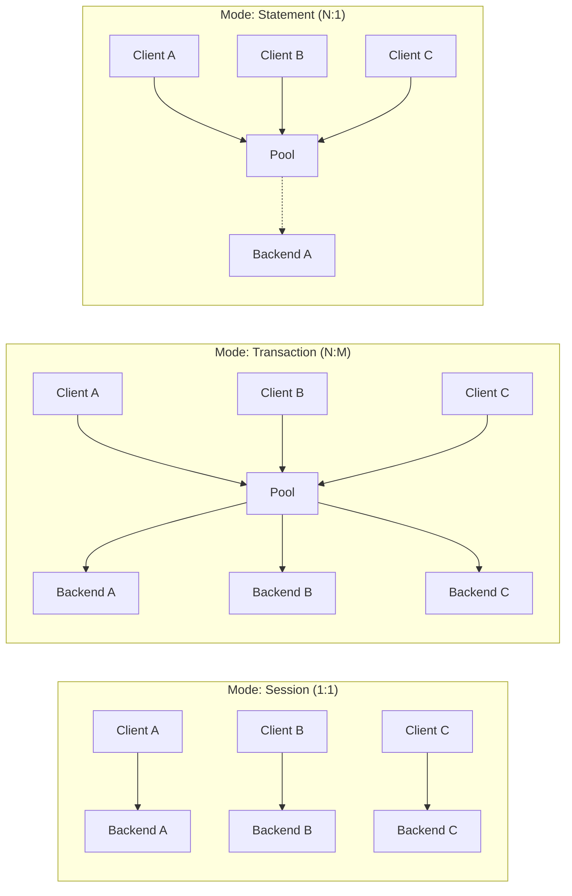

| Mode | Mapping | Use Case |
|------|---------|----------|
| **Session** | 1:1 client-to-backend | Temp tables, `SET` vars, `LISTEN/NOTIFY` |
| **Transaction** | N:M multiplexing | Web applications (default) |
| **Statement** | N:1 aggressive | Simple query patterns |

### Pool Architecture

```mermaid
graph TB
    subgraph Pool["Pool Structure"]
        subgraph Clients["Client Side"]
            WaitQ[(Wait Queue)]
            Clients[Client<br/>Connections]
        end
        
        subgraph Servers["Server Side"]
            Backend1[Backend A<br/>Healthy]
            Backend2[Backend B<br/>Healthy]
            Backend3[Backend C<br/>Unhealthy]
            Idle[(Idle Pool)]
            Active[(Active<br/>Connections)]
        end
        
        subgraph State["State Tracking"]
            Sessions[(Session<br/>Map)]
            Txns[(Transaction<br/>Boundaries)]
        end
    end
    
    Clients --> WaitQ
    WaitQ -->|get backend| Idle
    Idle -->|allocate| Active
    Active -->|release| Idle
    
    Sessions -.->|track| Clients
    Txns -.->|detect| Active
    HealthCheck -.->|monitor| Backend1
    HealthCheck -.->|monitor| Backend2
    HealthCheck -.->|monitor| Backend3
```

### Pool Manager

The `Manager` handles lifecycle for all pools:

```go
type Manager struct {
    pools map[string]*Pool  // pool name → pool
    logger logger.Logger
    mu     sync.RWMutex
}
```

Operations:
- `CreatePool(cfg)` — Create and start a new pool
- `GetPool(name)` — Retrieve a pool by name
- `RemovePool(name)` — Stop and remove a pool
- `Close()` — Shutdown all pools

### Connection State Reset

When a backend connection returns to the pool, its state must be reset:

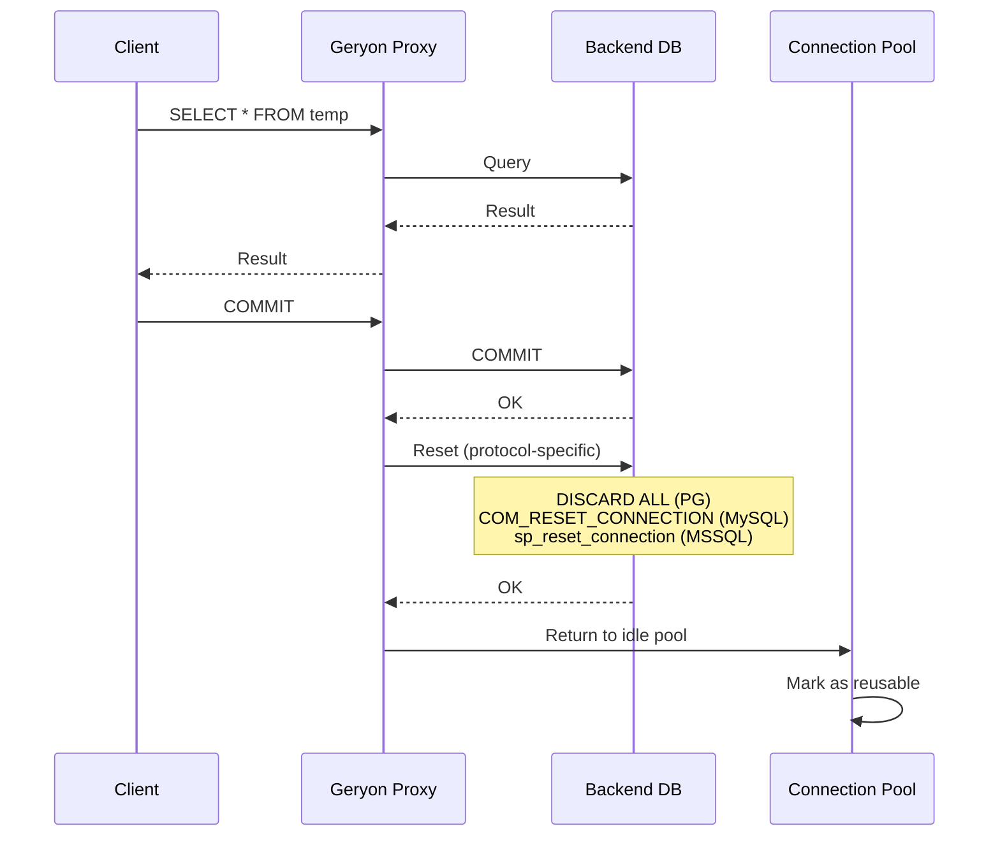

---

## Routing

### Read/Write Split

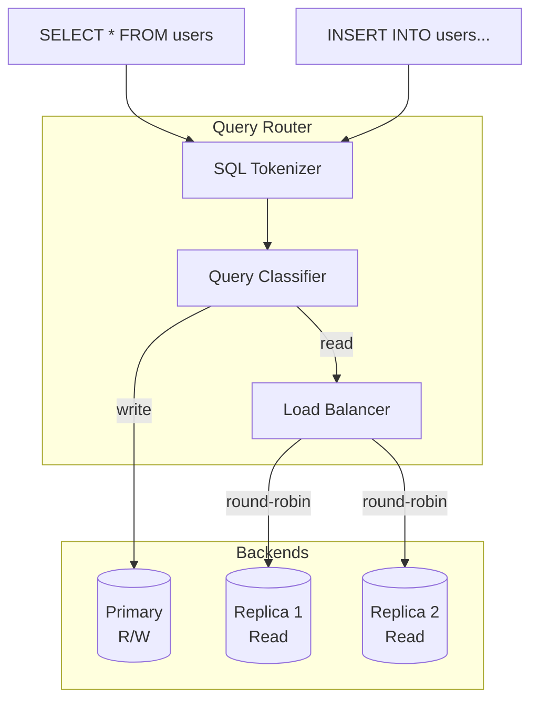

Query types:
- **read** — `SELECT`, `SHOW`, `DESCRIBE`
- **write** — `INSERT`, `UPDATE`, `DELETE`, `CREATE`, `DROP`
- **transaction** — `BEGIN`, `COMMIT`, `ROLLBACK`, transaction statements

---

## Clustering

### Architecture

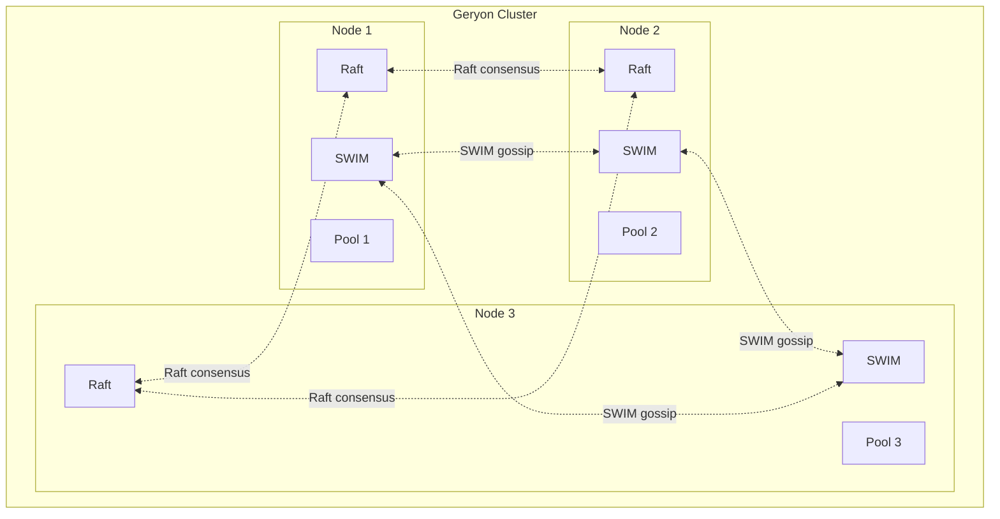

### Raft Consensus

Geryon implements Raft from scratch for:
- **Leader election** — Single leader for writes
- **Log replication** — Replicate configuration changes
- **Membership changes** — Add/remove nodes safely

Raft node states: `Follower` → `Candidate` → `Leader`

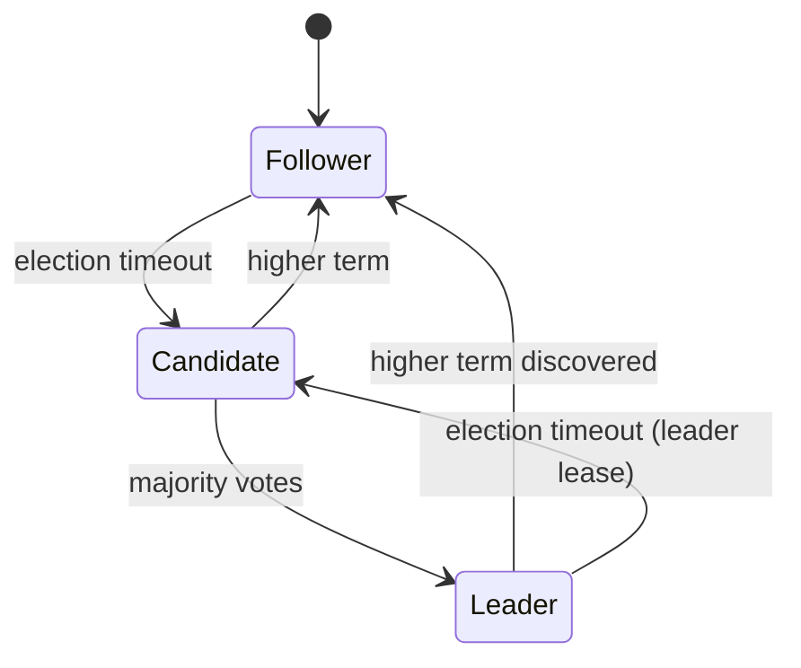

### SWIM Gossip

SWIM (Scalable Weakly-consistent Infection-style Membership) provides:
- **Node discovery** — Automatic discovery of new cluster members
- **Failure detection** — Suspicion-based failure detection
- **Propagation** — Anti-entropy via random gossip

---

## Security

### Authentication Flow

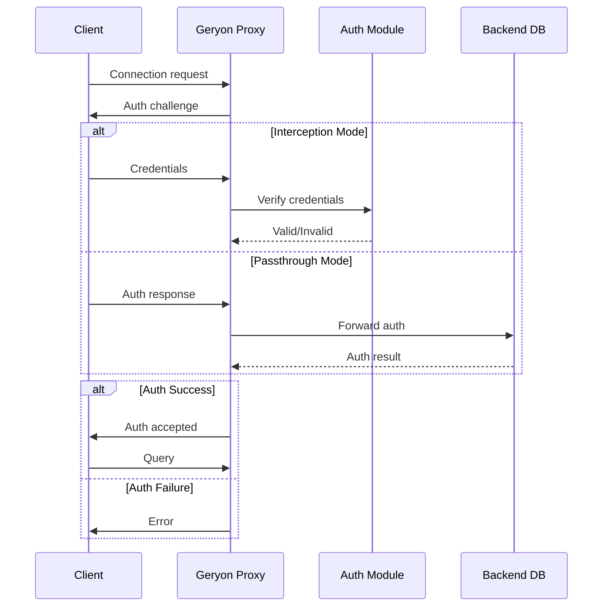

### SCRAM-SHA-256

PostgreSQL uses SCRAM-SHA-256 for secure password verification:

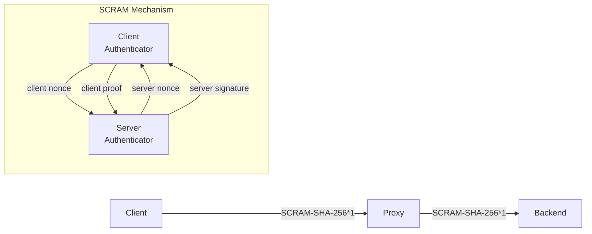

### Rate Limiting

Authentication attempts are rate-limited per source IP:

```go
type AuthLimiter struct {
    mu         sync.Mutex
    attempts   map[string]*attempts
    lastChange map[string]time.Time
}
```

---

## Configuration

### Hot-Reload Mechanism

```mermaid
graph TB
    subgraph File["Config File"]
        Yaml[geryon.yaml]
    end
    
    subgraph Loader["Config Loader"]
        Watcher[File Watcher]
        Parser[YAML Parser]
        Validator[Validator]
    end
    
    subgraph Runtime["Runtime"]
        AtomicPtr[atomic.Pointer[Config]]
        Pools[Pool Manager]
        Listeners[Listeners]
    end
    
    Yaml -->|change| Watcher
    Watcher -->|reload| Parser
    Parser -->|parse| Validator
    Validator -->|valid| AtomicPtr
    AtomicPtr -->|safe reload| Pools
    AtomicPtr -->|safe reload| Listeners
    
    Watcher -.->|SIGHUP| Parser
```

### Safe vs Unsafe Reload

| Safe (No Restart) | Unsafe (Require Restart) |
|-------------------|---------------------------|
| Pool limits | Port changes |
| Auth users | Body type |
| Logging level | TLS cert paths |
| Query timeout | Cluster settings |

### Configuration Structure

```yaml
global:
  log_level: info
  log_format: json

admin:
  rest:
    listen: "127.0.0.1:8080"
  grpc:
    listen: "127.0.0.1:9090"
  mcp:
    listen: "127.0.0.1:8081"

cluster:
  enabled: false
  raft:
    listen: "0.0.0.0:7000"
  gossip:
    listen: "0.0.0.0:7001"

pools:
  - name: "main-pg"
    body: postgresql
    mode: transaction
    listen:
      host: "0.0.0.0"
      port: 5432
    backend:
      hosts:
        - host: "localhost"
          port: 5433
          role: primary
```

---

## Data Flow Diagrams

### Query Flow (PostgreSQL)

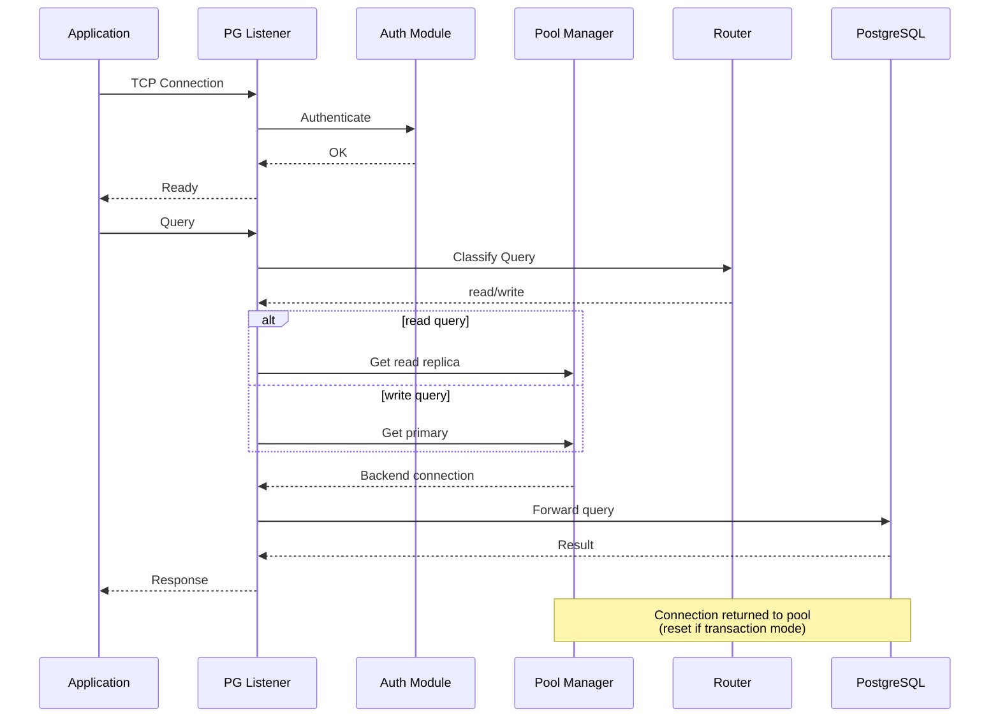

### Proxy Relay Architecture

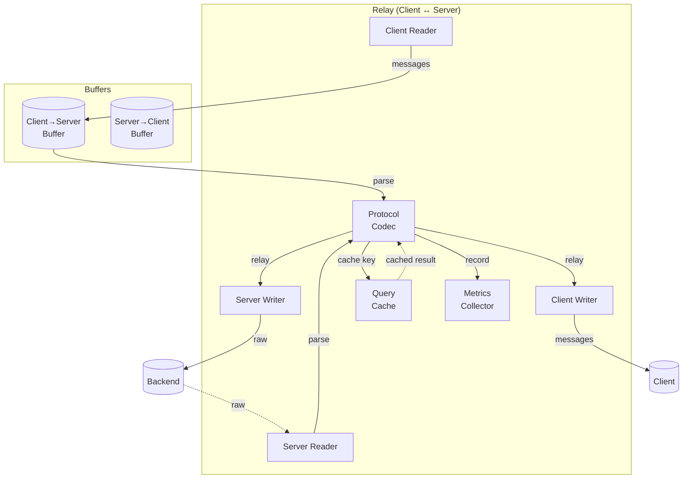

### Health Check Flow

```mermaid
graph TB
    subgraph Health["Health Checker"]
        Timer[Timer]
        Check[Health Check<br/>Executor]
        Backend1[(Backend A)]
        Backend2[(Backend B)]
        Backend3[(Backend C)]
    end
    
    Timer -->|tick| Check
    Check -->|ping| Backend1
    Check -->|ping| Backend2
    Check -->|ping| Backend3
    
    Backend1 -->>|healthy| Check
    Backend2 -->>|unhealthy| Check
    Backend3 -->>|timeout| Check
    
    Check -->|update| Status[Health Status]
    
    Status -->|mark| Backend2
    Status -->|mark| Backend3
```

---

## Memory & Performance

### Memory Management

- **Query Cache** — LRU with configurable TTL
- **Prepared Statement Cache** — Per-backend statement cache
- **Connection Pool** — Pre-configured min/max connections
- **Session Memory** — Bounded session tracking maps

### Concurrency Model

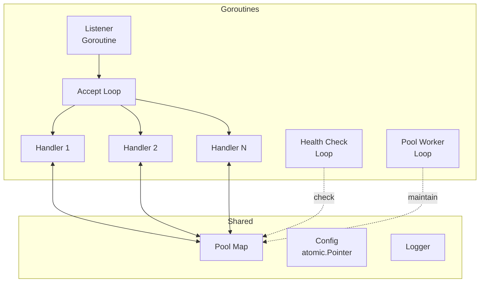

---

## Testing Strategy

### Test Layers

| Layer | Location | Command |
|-------|----------|---------|
| Unit | `*_test.go` co-located | `go test -short -race` |
| Integration | `integration-tests/` | `go test -v` (requires DBs) |
| Benchmarks | `benchmarks/` | `go test -bench=. -benchmem` |

### CI/CD Pipeline

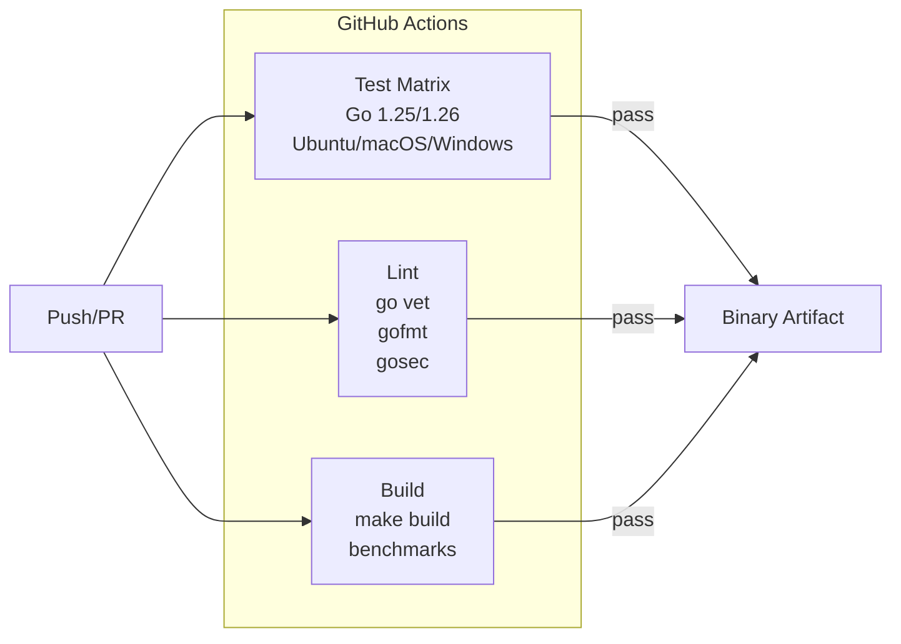

---

## Extension Points

### Adding a New Body (Protocol)

1. **Codec** — Implement in `internal/protocol/{db}/`
   - Message framing
   - Authentication handling
   - Query/response serialization

2. **Proxy Handler** — Add to `internal/proxy/listener.go`
   - Protocol-specific handshake
   - Connection state machine
   - Relay logic

3. **Connection Resetter** — Add to `internal/pool/reset.go`
   - Protocol-specific reset command

4. **Health Check** — Update `internal/pool/health.go`
   - Protocol-specific health query

### Prepared Statement Interface

```go
type PreparedStatementCache interface {
    Get(key string) (*stmt.PreparedStatement, bool)
    Put(key string, ps *stmt.PreparedStatement)
    Invalidate(key string)
    Clear()
}
```

### Connection Resetter Interface

```go
type ConnectionResetter interface {
    Reset(ctx context.Context, conn net.Conn) error
}

type PostgresResetter struct{ ... }
type MySQLResetter struct{ ... }
type MSSQLResetter struct{ ... }
```

---

## Glossary

| Term | Definition |
|------|------------|
| **Body** | Protocol handler for a specific database (PostgreSQL, MySQL, MSSQL) |
| **Backend** | Target database server that Geryon connects to |
| **Frontend** | Client application connecting to Geryon |
| **Pool** | Collection of backend connections available for reuse |
| **Relay** | Bidirectional data transfer between client and backend |
| **SCRAM** | Salted Challenge Response Authentication Mechanism |
| **SWIM** | Scalable Weakly-consistent Infection-style Membership protocol |
| **WAL** | Write-Ahead Log for Raft log replication |
| **FSM** | Finite State Machine for Raft state replication |

---

## Protocol Details

### PostgreSQL Protocol (Frontend/Backend v3.0)

The PostgreSQL body implements the full v3.0 wire protocol:

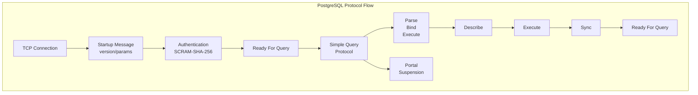

**Message Types:**
- `Authentication*` — Auth challenge/response
- `StartupMessage` — Protocol version, user, database
- `Query` — Simple query protocol
- `Parse` / `Bind` / `Execute` — Extended query protocol
- `ReadyForQuery` — Transaction state indicator
- `NoticeResponse` — Warnings/notices
- `NoticeResponse` — Data row responses

### MySQL Protocol (Handshake v10)

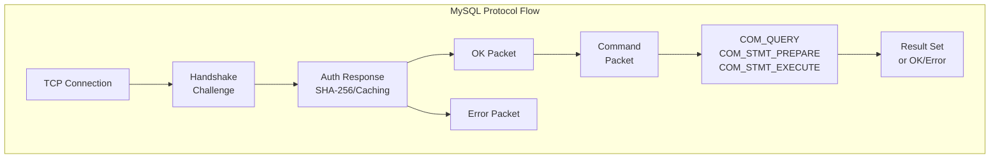

**Auth Methods:**
- `mysql_native_password` — Challenge-response
- `caching_sha2_password` — SHA-256 with server-side caching

### MSSQL Protocol (TDS 7.4+)

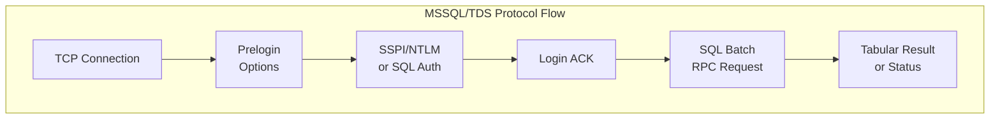

**Features:**
- SSPI/Kerberos integration
- RPC calls for stored procedures
- Bulk copy (BCP)
- MARS (Multiple Active Result Sets)

### Protocol Codec Interface

All three protocols implement a common codec interface:

```go
type Codec interface {
    Protocol() common.Protocol
    
    // Authentication
    HandleAuth(ctx context.Context, conn net.Conn, 
              authHandler AuthHandler) error
    
    // Message handling
    EncodeMessage(msg *common.Message) ([]byte, error)
    DecodeMessage(data []byte) (*common.Message, error)
    
    // Health check
    HealthCheckQuery() string
    
    // Connection reset
    ResetQuery() string
}
```

---

## Transaction Management

### Transaction Lifecycle

```mermaid
stateDiagram-v2
    [*] --> Idle: New connection
    Idle --> InTransaction: BEGIN
    InTransaction --> InTransaction: INSERT/UPDATE/DELETE
    InTransaction --> Committed: COMMIT
    InTransaction --> RolledBack: ROLLBACK
    Committed --> Idle: ReadyForQuery
    RolledBack --> Idle: ReadyForQuery
    Idle --> [*]: Close connection
```

### TransactionBoundary Detector

The `TransactionManager` tracks transaction state per session:

```go
type TransactionManager struct {
    mu        sync.Mutex
    txns      map[uint64]*TransactionInfo
    onCommit  func(sessionID uint64)
    onAbort   func(sessionID uint64)
}

type TransactionInfo struct {
    SessionID  uint64
    BackendID  uint64
    StartedAt  time.Time
    SQL        string  // First query in transaction
    ReadOnly   bool
}
```

### Session Mode Tracking

Each client session is mapped to a backend connection:

```mermaid
graph TB
    subgraph SessionMode["Session Mode (1:1)"]
        C1[Client 1] --> B1[Backend A]
        C2[Client 2] --> B2[Backend B]
        C3[Client 3] --> B3[Backend C]
        
        subgraph SessionMap["Session Registry"]
            SM1[Session 1 → Backend A]
            SM2[Session 2 → Backend B]
            SM3[Session 3 → Backend C]
        end
    end
```

**Session tracking includes:**
- Client address and connection time
- Assigned backend connection
- Current query state
- Transaction status

---

## Admin API Reference

### REST API Endpoints (Port 8080)

| Method | Endpoint | Description |
|--------|----------|-------------|
| `GET` | `/api/v1/health` | Health check |
| `GET` | `/api/v1/stats` | Pool statistics |
| `GET` | `/api/v1/pools` | List all pools |
| `POST` | `/api/v1/pools` | Create new pool |
| `GET` | `/api/v1/pools/:name` | Get pool details |
| `PUT` | `/api/v1/pools/:name` | Update pool config |
| `DELETE` | `/api/v1/pools/:name` | Delete pool |
| `POST` | `/api/v1/pools/:name/backends` | Add backend |
| `DELETE` | `/api/v1/pools/:name/backends/:addr` | Remove backend |
| `GET` | `/api/v1/config` | Get current config |
| `POST` | `/api/v1/config/reload` | Hot reload config |
| `GET` | `/metrics` | Prometheus metrics |

```mermaid
graph LR
    subgraph REST["REST API :8080"]
        Health[/api/v1/health]
        Stats[/api/v1/stats]
        Pools[/api/v1/pools]
        Config[/api/v1/config]
        Metrics[/metrics]
    end
    
    Health --> Dashboard[Dashboard]
    Stats --> Dashboard
    Pools --> Dashboard
    Config --> Dashboard
    Metrics --> Prometheus
```

### gRPC API Endpoints (Port 9090)

| Service | Method | Description |
|---------|--------|-------------|
| `Admin` | `StreamStats` | Stream statistics updates |
| `Pool` | `CreatePool` | Create pool via gRPC |
| `Pool` | `UpdatePool` | Update pool config |
| `Pool` | `GetPool` | Get pool info |
| `Cluster` | `JoinCluster` | Join cluster node |

### MCP Server (Port 8081)

Model Context Protocol server for AI tool integration:

```go
type MCPServer struct {
    log       logger.Logger
    config    *MCPConfig
    poolMgr   *pool.Manager
    cluster   *cluster.Cluster
    clients   map[string]*mcpClient
}
```

**Available tools:**
- `pool_list` — List all pools and their stats
- `pool_create` — Create a new pool
- `pool_update` — Update pool configuration
- `backend_add` — Add backend to pool
- `backend_remove` — Remove backend from pool
- `config_reload` — Trigger hot reload
- `cluster_status` — Get cluster state

---

## File Structure

```
GeryonProxy/
├── cmd/geryon/
│   ├── main.go              # Entry point, signal handling
│   ├── main_test.go
│   └── embed.go             # Dashboard assets (embed.FS)
│
├── internal/
│   ├── auth/
│   │   ├── auth.go          # User database, auth handlers
│   │   ├── cert.go          # TLS certificate handling
│   │   └── scram.go         # SCRAM-SHA-256 implementation
│   │
│   ├── cache/
│   │   ├── store.go         # LRU cache with TTL
│   │   └── store_test.go
│   │
│   ├── cluster/
│   │   ├── cluster.go       # Raft + SWIM integration
│   │   ├── coordinator.go   # Cluster coordination
│   │   └── integration_test.go
│   │
│   ├── config/
│   │   ├── config.go        # Config structs
│   │   ├── loader.go        # YAML parsing
│   │   └── watcher.go       # File watching
│   │
│   ├── pool/
│   │   ├── pool.go          # Core pool implementation
│   │   ├── manager.go       # Multi-pool management
│   │   ├── session.go       # Session tracking
│   │   ├── transaction.go   # Transaction boundaries
│   │   ├── routing.go       # Read/write split
│   │   ├── health.go        # Health checking
│   │   ├── reset.go         # Connection reset
│   │   └── strategy.go      # Pooling strategy
│   │
│   ├── proxy/
│   │   └── listener.go      # TCP listener, protocol handlers
│   │
│   ├── protocol/
│   │   ├── common/
│   │   │   └── message.go   # Shared message types
│   │   ├── postgresql/
│   │   │   └── codec.go     # PostgreSQL codec
│   │   ├── mysql/
│   │   │   └── codec.go     # MySQL codec
│   │   └── mssql/
│   │       └── codec.go     # MSSQL/TDS codec
│   │
│   ├── api/
│   │   ├── rest/
│   │   │   └── server.go    # REST API server
│   │   ├── grpc/
│   │   │   └── server.go    # gRPC API server
│   │   ├── mcp/
│   │   │   └── server.go    # MCP server
│   │   └── dashboard/
│   │       └── server.go    # Web dashboard
│   │
│   ├── raft/
│   │   ├── raft.go          # Raft consensus
│   │   ├── fsm.go           # Finite state machine
│   │   ├── wal.go           # Write-ahead log
│   │   └── snapshot.go      # Snapshotting
│   │
│   ├── swim/
│   │   └── swim.go          # SWIM gossip protocol
│   │
│   ├── metrics/
│   │   └── metrics.go       # Prometheus metrics
│   │
│   ├── logger/
│   │   ├── logger.go        # Structured logging
│   │   └── querylog.go      # Query logging
│   │
│   ├── cache/
│   │   └── store.go         # Query result cache
│   │
│   ├── stmt/
│   │   └── cache.go         # Prepared statement cache
│   │
│   ├── tokenizer/
│   │   └── tokenizer.go     # SQL query classification
│   │
│   └── tlsutil/
│       ├── config.go        # TLS configuration
│       └── tls.go           # TLS utilities
│
├── integration-tests/        # Integration tests (requires DBs)
├── benchmarks/              # Performance benchmarks
│
├── geryon.example.yaml     # Example configuration
├── Makefile                # Build targets
└── ARCHITECTURE.md         # This document
```

---

## Error Handling

### Error Propagation

```mermaid
graph TD
    subgraph Layers["Error Handling Layers"]
        Client[Client Error] --> Proxy[Proxy Error]
        Proxy --> Pool[Pool Error]
        Pool --> Backend[Backend Error]
    end
    
    subgraph Types["Error Types"]
        AuthErr[Auth Error]
        ConnErr[Connection Error]
        QueryErr[Query Error]
        TimeoutErr[Timeout Error]
    end
    
    Backend -->|error| Pool
    Pool -->|wrapped| Proxy
    Proxy -->|status| Client
```

### Connection Error Recovery

1. **Backend down** → Mark unhealthy, redistribute load
2. **Query timeout** → Cancel query, return connection
3. **Pool exhausted** → Queue with timeout, return error
4. **Auth failure** → Rate limit, log attempt

### Graceful Degradation

- **Health checks** — Remove unhealthy backends from pool
- **Circuit breaker** — Too many failures → open circuit
- **Fallback** — Replica unavailable → fallback to primary

---

## Monitoring & Observability

### Prometheus Metrics

```mermaid
graph LR
    subgraph Metrics["Exposed Metrics"]
        PoolMetrics[Pool Stats<br/>connections_active<br/>connections_idle<br/>wait_queue_length]
        QueryMetrics[Query Stats<br/>queries_total<br/>query_duration_seconds<br/>queries_cached]
        AuthMetrics[Auth Stats<br/>auth_attempts<br/>auth_failures]
        ClusterMetrics[Cluster Stats<br/>nodes_healthy<br/>raft_leader]
    end
    
    PoolMetrics --> Expose[/metrics]
    QueryMetrics --> Expose
    AuthMetrics --> Expose
    ClusterMetrics --> Expose
    
    Expose --> Prometheus
    Prometheus --> Grafana
```

### Key Metrics

| Metric | Type | Description |
|--------|------|-------------|
| `geryon_pool_connections_active` | Gauge | Active backend connections |
| `geryon_pool_connections_idle` | Gauge | Idle backend connections |
| `geryon_pool_wait_queue_length` | Gauge | Clients waiting for connection |
| `geryon_queries_total` | Counter | Total queries processed |
| `geryon_query_duration_seconds` | Histogram | Query latency distribution |
| `geryon_auth_attempts_total` | Counter | Authentication attempts |
| `geryon_auth_failures_total` | Counter | Failed authentications |

### Structured Logging

All logs include:
- `timestamp` — ISO 8601 format
- `level` — debug/info/warn/error
- `pool` — pool name
- `client` — client address
- `backend` — backend address
- `query` — query fingerprint (sanitized)

---

## Performance Characteristics

### Latency Breakdown

```
Client → Proxy → Pool → Backend → Response
  │        │       │        │
  └────────┴───────┴────────┴── Total: p99 < 5ms (local)
```

### Throughput

| Pool Mode | Typical Throughput |
|-----------|-------------------|
| Session | 10K-50K qps/pool |
| Transaction | 50K-200K qps/pool |
| Statement | 100K-500K qps/pool |

### Memory Footprint

- **Per connection** — ~50KB (backend), ~20KB (client)
- **Pool overhead** — ~1MB per pool
- **Query cache** — Configurable (default 100MB)
- **Prepared stmts** — ~1KB per statement

---

## Security Considerations

### Threat Model

```mermaid
graph TD
    subgraph Threats["Potential Threats"]
        Inj[SQL Injection]
        AuthB[Auth Bypass]
        CredL[Credential Leak]
        DoS[Denial of Service]
        MITM[Man-in-Middle]
    end
    
    subgraph Mitigations["Mitigations"]
        Sanitize[Input Sanitization]
        SCRAM[SCRAM Auth]
        TLS[TLS Required]
        RateLimit[Rate Limiting]
        Encrypt[TLS Encryption]
    end
    
    Inj --> Sanitize
    AuthB --> SCRAM
    CredL --> Encrypt
    DoS --> RateLimit
    MITM --> TLS
```

### Defense in Depth

1. **Network** — TLS encryption, internal-only binds
2. **Auth** — SCRAM-SHA-256, rate limiting
3. **Query** — Parameterized queries, query normalization
4. **Connection** — Connection limits, idle timeouts
5. **Config** — Secure defaults, validation

---

## Deployment Topologies

### Single Instance

```mermaid
graph LR
    App --> Geryon
    Geryon --> PG[(PostgreSQL)]
    Geryon --> MY[(MySQL)]
    Geryon --> MS[(MSSQL)]
```

### HA Cluster

```mermaid
graph TB
    subgraph Cluster["Geryon Cluster"]
        N1[Node 1<br/>:5432 :3306 :1433]
        N2[Node 2<br/>:5432 :3306 :1433]
        N3[Node 3<br/>:5432 :3306 :1433]
    end
    
    N1 <-.->|Raft| N2
    N2 <-.->|Raft| N3
    N3 <-.->|Raft| N1
    
    App1[App] --> LB[Load Balancer]
    LB --> N1
    LB --> N2
    LB --> N3
    
    N1 --> PG1[(PostgreSQL<br/>Primary)]
    N2 --> PG2[(PostgreSQL<br/>Replica)]
    N3 --> PG2
```

### Multi-Region

```mermaid
graph LR
    subgraph Region1["us-east-1"]
        G1[Geryon] --> PGS1[(PostgreSQL)]
    end
    
    subgraph Region2["eu-west-1"]
        G2[Geryon] --> PGS2[(PostgreSQL)]
    end
    
    G1 <-.->|Replication| G2
```